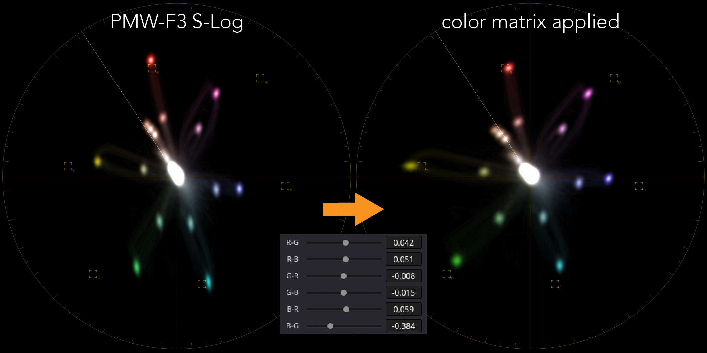

# free-DCTL
a collection of DCTL files, mostly small helpers in DaVinci Resolve

## Color Matrix
3x3 color matrix DCTL with option to invert the matrix. This is also known as RGB channel mixer. This DCTL is mostly targeted for technical or color space transforms.

### Parameters
* R-R, R-G, R-B: Red channel contribution (first row of 3x3 matrix)
* G-R, G-G, G-B: Green channel contribution (second row of 3x3 matrix)
* B-R, B-G, B-R: Blue channel contribution (third row of 3x3 matrix)
* Invert: Inverts the matrix

## color_math.h
Header file with a growing collection of color math helper functions, such as marix transforms etc.

## Color Pizza
Similar to DaVinci Resolve's Color Slice. It provides hue shift and saturation for the six primaries.

### Parameters
* R - Y-M: Red hue shift
* R - Sat: Red saturation
* Y - G-R: Yellow hue shift
* Y - Sat: Yellow saturation
* G - C-Y: Green hue shift
* G - Sat: Green saturation
* C - B-G: Cyan hue shift
* C - Sat: Cyan saturation
* B - M-G: Blue hue shift
* B - Sat: Blue saturation
* M - R-B: Magenta hue shift
* M - Sat: Magenta saturation

## Custom ADX10
Converts ACES 2065-1 into ADX10 with custom matrices. Allows tweaking that film look.

The defaults are based on Alexa Classic film style matrix and Dmin set for DR 2383 D65 LUT.

## Exposure Ramp
Another ramp generator. Useful to check out LUT responses and color space transforms etc.
It offers an exposure ramp with adjustable stops below and above middle gray as well as shifting the exposure index.

### Parameters
* Stops Up: Stops over middle gray
* Stops Down: Stops below middle gray
* ISO: Exposure index
* Base ISO: Base ISO, needed to calculate middle gray to gether with the exposure index
* Show Gray: Enable to show middle gray value area

## False Colors
False Colors display for S-Log3. This is a replica of Sony's False Colors scheme.

## Normalized Color Matrix
Applies a normalized color matrix to video footage. This simplifies the usual 3x3 matrix to six parameters. Tweaking the parameters will retain white balance.

Originally my main purpose was to use it on S-Log footage of the Sony PMW-F3 which is lacking a proper color matrix.
It turned out to be very useful for all kind of footage, not just PMW-F3 footage, as creative color palette tool.
Since the matrix is normalized this makes it much easier than Resolved color mixer for example. Also there is no extra linearization needed for supported spaces.

Compare the vector scopes of the recorded PMW-F3 S-Log footage (left) and with the applied color matrix (right)

Recorded footage. Notice the pale yellows and greens and the magenta/cyan tint.

Color matrix applied. Notice rich more natural colors.

### Parameters
* R-G, R-B, G-R, G-B, B-R, B-G - the simplified 2x3 matrix
* Source - the type of source (Linear, S-Log, S-Log3)

### Examples
Matrix to match the Sony PMW-F3 to the Sony F35
* R-G: 0.099
* R-B: 0.075
* G-R: -0.050
* G-B: -0.043
* B-R: 0.020
* B-G: -0.305

## ProPhoto
Transforms ProPhoto color space into ACES AP0, both as DCTL and ACES IDT.

## Simple Ramp
A ramp generator. Useful to check out LUT responses and color space transforms etc.
It offer both linear and exposure ramp with either adjustable slope or stops.

### Parameters
* Stops: The linear slope factor or exposure stops when in Exposure mode
* Exposure Ramp: when enabled the ramp is expressed as exposure stops
* Gray: Value of mid gray

## Tetra Simple
Another flavor of the Tetra transformation, as described by Steve Yedlin ASC.

This DCTL is based on npeason's DCTL and provides a simplified UI with just 12 parameters, two for each primary. The third omitted paramter is calculated internally to ensure the vector moving along the plane of each tetrahedron. This leads to more stable results and pleasing saturation.

### Credits:
1. npeason's DCTL: https://github.com/npeason/Tetra-DCTLOFX
2. calvinsilly's Nuke implementation: https://github.com/calvinsilly/Tetrahedral-Interpolation
3. EmberLightVFX's Fusion implementation: https://github.com/EmberLightVFX/Tetrahedral-Interpolation-for-Fusion
4. Yedlin's video hinting at this transform: http://www.yedlin.net/DisplayPrepDemo/DispPrepDemoFollowup.html

## Value
A simple value generator, useful for testing.

### Parameters
* Value: The output value of the generator
